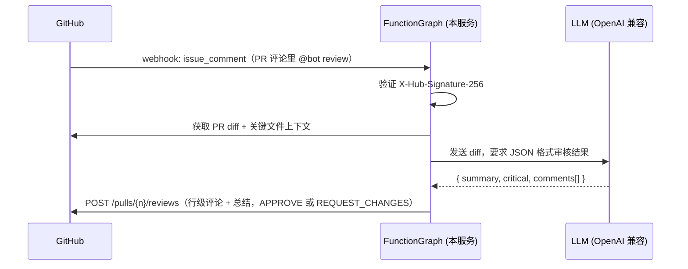

# github-ai-review

一个自托管的 GitHub App，用 LLM 自动审核 PR，并把行级评论 + 总结以 PR Review 的形式发回 GitHub。

- **零 npm 依赖**：JWT（RS256）用 Node 内置 `crypto` 实现，HTTP 用内置 `fetch`，无需打包 node_modules。
- **部署目标**：FunctionGraph（Node.js 运行时，HTTP 触发器）。
- **LLM**：任意 OpenAI 兼容 API（如 LiteLLM）。

## 工作原理



**触发方式（二选一）：**
1. **PR 打开时自动审核**：`pull_request` 的 `opened`/`reopened` 事件触发
2. **评论触发**：在 PR 评论里写 `@<BOT_MENTION> <TRIGGER_WORD>`（默认 `@ai-review review`），触发 `issue_comment` 事件

**审核结果：**
- 发现 critical 问题 → `REQUEST_CHANGES`
- 没有 critical 问题 → `APPROVE`（`REVIEW_MODE=auto` 时）

**自动排除：** 已删除的文件、依赖 lock 文件（npm/pnpm/yarn/Go/Cargo/Python/Ruby/PHP 等）、二进制/生成文件。

## 目录结构

```
github-ai-review/
├── index.js              # 入口：FunctionGraph handler + 本地开发服务器
└── src/
    ├── config.js         # 环境变量配置
    ├── jwt.js            # RS256 JWT（GitHub App 认证）
    ├── webhook.js        # Webhook 签名验证
    ├── github.js         # GitHub REST API 客户端（App 认证）
    ├── llm.js            # OpenAI 兼容 chat completions 客户端
    ├── prompt.js         # 审核 prompt + JSON 解析
    └── reviewer.js       # 审核流水线（diff 构建、上下文收集、发 review）
```

## 1. 创建 GitHub App

1. GitHub → **Settings → Developer settings → GitHub Apps → New GitHub App**
   - **App name**: `ai-review`（随意）
   - **Homepage URL**: 你的 FunctionGraph HTTP 触发器 URL
   - **Webhook active**: 勾选
   - **Webhook secret**: 生成并保存（后面填到 `WEBHOOK_SECRET`）
2. **Repository permissions**：
   - `Pull requests`: **Read and write**
   - `Contents`: **Read**
   - `Issues`: **Read**（用于读 PR 标签）
3. **Webhook permissions**：勾选 `pull_request` 和 `issue_comment`
4. 创建后记下 **App ID**（App settings 页面顶部）
5. **Generate a private key** → 下载 `.pem` 文件（填到 `GITHUB_APP_PRIVATE_KEY`）
6. **Install App** → 选择你的账号/组织 → 勾选要启用的仓库
7. 记下 App 的 **bot 名称**（App name + `[bot]`，如 `ai-review[bot]`），填到 `BOT_LOGIN`

## 2. 配置 FunctionGraph

1. 控制台 → 函数工作流 FunctionGraph → 创建函数
   - 运行环境：**Node.js 16+**（需要内置 `fetch`，Node 18 最佳）
   - 函数名称：`github-ai-review`
   - 执行方法（handler）：`index.handler`
   - 上传代码：把本目录（除 `.env`）打包成 zip 上传
2. **创建 HTTP 触发器**（公网访问），得到触发器 URL
3. **配置环境变量**（参考 `.env.example`）：

   | 变量 | 说明 |
   |------|------|
   | `GITHUB_APP_ID` | GitHub App 的 App ID |
   | `GITHUB_APP_PRIVATE_KEY` | PEM 私钥（换行用 `\n` 表示） |
   | `WEBHOOK_SECRET` | GitHub App 的 Webhook secret |
   | `BOT_LOGIN` | App 的 bot 名称，如 `ai-review[bot]` |
   | `BOT_MENTION` | 评论里触发审核的 @ 名称，如 `ai-review` |
   | `TRIGGER_WORD` | 触发关键词，如 `review` |
   | `LITELLM_BASE_URL` | OpenAI 兼容 API 的 base URL |
   | `LITELLM_API_KEY` | LLM 的 API key |
   | `LITELLM_MODEL` | 模型名 |
   | `REVIEW_MODE` | `auto`（推荐）/ `request_changes_if_critical` / `comment` |

4. **超时时间**：建议设为 **300 秒**（LLM 审核大 PR 可能较慢）
5. **内存**：256 MB 足够

## 3. 配置 GitHub Webhook

GitHub App → **Webhooks** → Add webhook：

- **Active**: 勾选
- **Content type**: `application/json`
- **URL**: 你的 FunctionGraph HTTP 触发器 URL
- **Events**: 勾选 `pull_request` 和 `issue_comment`

## 4. 本地开发

```bash
cd github-ai-review
cp .env.example .env   # 填入真实值
node index.js          # 启动 http://localhost:8080
```

## 5. 使用

**方式一：PR 打开时自动审核**
1. 在安装了本 App 的仓库里打开 PR
2. GitHub 发送 `pull_request` 的 `opened`/`reopened` 事件 → 自动审核
3. 审核结果以一条 PR Review 出现：总结 + 行级评论（标注 critical / warning / suggestion）
   - 有 critical 问题 → **Request changes**
   - 没有 critical 问题 → **Approve**

**方式二：评论触发**
1. 在 PR 评论里写 `@ai-review review`（`BOT_MENTION` 与 `TRIGGER_WORD` 可自定义）
2. GitHub 发送 `issue_comment` 事件 → 触发审核

**注意：**
- 机器人作者（`xxx[bot]`）的 PR 会自动跳过，避免审核循环
- `synchronize`（push 新 commit）事件不触发审核，避免每次 push 都刷一条 review

## 可调参数

| 变量 | 默认 | 说明 |
|------|------|------|
| `MAX_DIFF_CHARS` | 800000 | diff 总长度上限 |
| `MAX_CONTEXT_FILES` | 10 | 附带完整内容的文件数（选改动最小的几个） |
| `MAX_CONTEXT_FILE_CHARS` | 100000 | 单个上下文文件长度上限 |
| `MAX_COMMENTS` | 25 | 最多发出的行级评论数 |
| `LLM_TIMEOUT_MS` | 180000 | LLM 请求超时 |
| `LLM_MAX_TOKENS` | 8192 | LLM 最大输出 token |
| `LLM_TEMPERATURE` | 0.1 | 采样温度（低 = 更一致） |
| `SKIP_PATTERNS` | lock 文件等 | 跳过的文件（逗号分隔） |

## 注意事项

- **Webhook 重试**：服务对失败返回 200（只记日志），避免 GitHub 反复重试。如需重试，把 `runReview` 中的失败分支改为返回 500。
- **synchronize 事件**：默认不审核 push 新 commit（避免每次 push 都刷一条 review）。
- **密钥安全**：`GITHUB_APP_PRIVATE_KEY` 只放在 FunctionGraph 环境变量里，不要提交到仓库（`.env` 已在 .gitignore 中）。
- **FunctionGraph 超时**：大 PR 的审核可能较慢，函数超时建议 300 秒。
